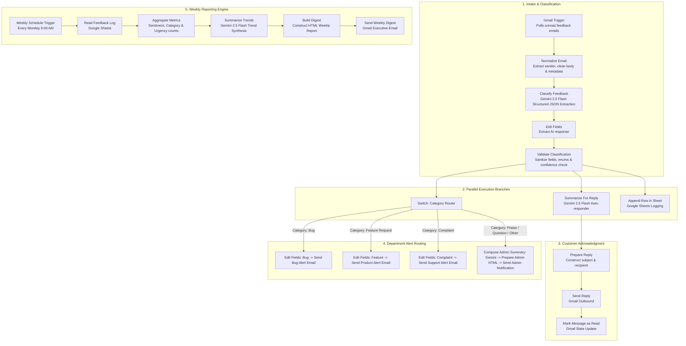

# Customer Feedback Intelligence (n8n Workflow)

An automated, AI-powered customer feedback classification, triage, and reporting engine built with **n8n**, **Google Gemini 2.5 Flash**, **Gmail**, and **Google Sheets**.

---

## 📖 Overview & What It Does

The **Customer Feedback Intelligence** workflow continuously monitors incoming customer support and feedback emails, uses Google Gemini AI to analyze and categorize each message, automatically responds to the customer, routes alerts to designated teams based on severity and category, logs all structured data to Google Sheets, and sends a scheduled weekly analytics digest to administrators.

### Key Capabilities
- **Automated Email Ingestion**: Listens for incoming feedback, bugs, complaints, and product mentions via Gmail triggers.
- **AI-Powered Multi-Attribute Classification**: Extracts structured information including product, feature, issue, sentiment, category, severity, summary, suggested actions, and confidence score.
- **Smart Validation & Quality Guardrails**: Cleanses, standardizes, and validates AI outputs with fallback thresholds for manual human review flags.
- **Instant Customer Acknowledgment**: Generates a professional, AI-crafted 1–2 sentence email response acknowledging the customer's input and marks original threads as read.
- **Role-Based Alert Routing**: Intelligently routes categorized feedback (Bugs, Feature Requests, Complaints, and General Admin inquiries) directly to the relevant internal department.
- **Centralized Data Logging**: Stores every classified feedback entry into Google Sheets for historical records and business intelligence.
- **Weekly Executive Digest**: Aggregates all feedback weekly, generates trend analysis with Gemini AI, and delivers an executive performance report.

---

## 🛠️ Step-by-Step Setup & Node Configuration Guide

> **New to n8n? Don't worry!** This step-by-step guide is written in plain English so that anyone—regardless of technical background—can easily import, configure, customize, and run this customer feedback intelligence system.

---

### 📌 1. What This Setup Accomplishes
When you finish this setup, your n8n workspace will have a fully functional 24/7 assistant that:
- Connects to your **Gmail inbox** to catch customer feedback automatically.
- Uses **Google Gemini AI** to understand the email and draft an instant polite reply.
- Connects to your **Google Sheet** to save every piece of feedback in a structured database.
- Routes alerts to specific **team members** depending on whether it's a Bug, Feature Idea, Complaint, or General Praise.
- Sends an **Executive Summary** every Monday morning at 9:00 AM.

---

### 📋 2. Prerequisites (What You Need Before Starting)
You only need 3 free accounts ready:
1. **n8n Account / Workspace**: An active instance on [n8n Cloud](https://n8n.io/) or self-hosted on your machine/server.
2. **Google Account**: A regular Gmail / Google Workspace account with access to **Gmail** and **Google Sheets**.
3. **Google Gemini API Key**: Free to generate in 30 seconds at [Google AI Studio](https://aistudio.google.com/) (Click *Get API Key* ➔ *Create API Key*).
4. **Google Sheet for Logging**:
   - Go to [Google Sheets](https://sheets.new) and create a new blank spreadsheet named **`Customer Feedback Log`**.
   - In **Row 1** of `Sheet1`, copy and paste these exact 14 column headers across cells `A1` to `N1`:
     ```text
     receivedAt	from	subject	body	product	feature	issue	sentiment	category	severity	summary	suggestedAction	confidence	reviewrequest
     ```
   *(Tip: Copy the line above, click cell A1 in Google Sheets, and paste. Sheets will automatically split each title into its own column!)*

---

### 📥 3. Step 1: Import the Workflow File into n8n
1. Open your n8n dashboard in your web browser.
2. Click **Workflows** in the left sidebar ➔ Click **Add Workflow** (or **New Workflow** in the top right).
3. In the top-right corner of the canvas, click the **three dots (`...`)** menu ➔ Select **Import from File**.
4. Select the [workflow.json](file:///c:/Users/LUCIFER/OneDrive/Documents/customer_feedback_intelligence/workflow.json) file from your computer.
5. All the connected nodes will appear neatly on your canvas.

---

### 🔑 4. Step 2: Connect Your Accounts (Credentials)
When you first import the file, some nodes will show an orange warning icon. This is normal—it just means you need to connect your own accounts:

1. **Connect Gmail (For reading & sending emails)**:
   - Double-click the **`Gmail Trigger`** node (far left).
   - Under *Credential for Gmail OAuth2*, click **Create New Credential**.
   - Follow the popup window to sign in with your Google / Gmail account and click **Allow**.
   - *(Once connected, all other Gmail nodes in this workflow will automatically use this account).*
2. **Connect Google Sheets (For logging feedback)**:
   - Double-click the **`Append row in sheet`** node.
   - Under *Credential for Google Sheets OAuth2*, click **Create New Credential**.
   - Sign in with your Google account and grant spreadsheet permissions.
3. **Connect Google Gemini AI (The AI Brain)**:
   - Double-click the **`Classify Feedback`** node.
   - Under *Credential for Google Gemini*, click **Create New Credential**.
   - Paste your free API Key from Google AI Studio and click **Save**.

---

### 👥 5. Step 3: Understand Team Roles & Assign Email Destinations

This workflow delivers tailored notifications to specific people in your organization based on the AI's classification. Here is a breakdown of the roles and who is responsible for each type of feedback:

| Role | Trigger Category | Responsibility | Assigned Node |
| :--- | :--- | :--- | :--- |
| **👨‍💻 Software Engineer / QA** | 🐛 **Bug / Error** | Fixes technical issues, crashes, or broken features. | `Send a message` |
| **💡 Product Manager** | 💡 **Feature Request** | Evaluates customer ideas and updates the product roadmap. | `Send a message1` |
| **🤝 Customer Support Lead** | ⚠️ **Complaint** | Handles unhappy users and de-escalates critical grievances. | `Send a message2` |
| **🏢 Admin / Operations Lead** | 💬 **Praise & Questions** | Manages general inquiries and shares positive praise. | `Send Admin Notification` |
| **📊 Executives / Leadership** | 📈 **Weekly Summary** | Reviews overall health and weekly satisfaction metrics. | `Send Weekly Digest` |
| **🙋‍♂️ The Customer** | 💬 **Auto-Reply** | Receives an instant, professional acknowledgment email. | `Send Reply` |
| **🔍 Human Quality Reviewer** | 📋 **Low-Confidence Flags** | Inspects any email where `reviewrequest = true` in Google Sheets. | Google Sheet Filter |

---

### ⚙️ 6. Step 4: Configure Specific Node Fields (What to Change for Each Role)

> 💡 **Good News**: You only need to touch **TWO categories of nodes** (Google Sheets & Email Destinations). All other nodes (AI Prompts, Data Sanitization, Customer Auto-Reply, Routing Logic) work automatically right out of the box!

#### A. Google Sheets Nodes (2 Nodes to Set)
Open these nodes to tell n8n which spreadsheet to use:

1. **`Append row in sheet` node**:
   - **Field `Document`**: Select your `Customer Feedback Log` sheet.
   - **Field `Sheet Name`**: Select `Sheet1`.
   - *What it does*: Writes 14 columns of analyzed data (date, customer email, product, issue, sentiment, severity, summary, suggested action).
2. **`Read Feedback Log` node** *(near the weekly schedule)*:
   - **Field `Document`**: Select the same `Customer Feedback Log` sheet.
   - **Field `Sheet Name`**: Select `Sheet1`.
   - *What it does*: Reads the past week's feedback entries to generate the Monday report.

---

#### B. Role-Based Email Nodes (5 Nodes to Configure)
Double-click each node below and configure the specific fields:

##### 1. 🐛 Bug Alert Node (`Send a message`)
- **Node Name**: `Send a message`
- **Field `Send To`**: ✏️ **Change this** to your Developer, QA team, or engineering lead email (e.g. `dev-team@yourcompany.com`).
- **Field `Subject`**: Pre-filled with `=Bug in {{ $json.product }}` (automatically inserts the product name).
- **Field `Message`**: Pre-formatted template containing:
  - **Date**: `{{ $json.receivedAt }}`
  - **Product**: `{{ $json.product }}`
  - **Subject**: `{{ $json.subject }}`
  - **Summary**: `{{ $json.summary }}`
  - **Suggestion**: `{{ $json.suggestedAction }}`

##### 2. 💡 Feature Request Alert Node (`Send a message1`)
- **Node Name**: `Send a message1`
- **Field `Send To`**: ✏️ **Change this** to your Product Manager or Roadmap team email (e.g. `product@yourcompany.com`).
- **Field `Subject`**: Pre-filled with `Feature to add`.
- **Field `Message`**: Pre-formatted template containing the date, customer subject, product, category, AI summary of the request, and suggested next step.

##### 3. ⚠️ Customer Complaint Alert Node (`Send a message2`)
- **Node Name**: `Send a message2`
- **Field `Send To`**: ✏️ **Change this** to your Customer Support Lead email (e.g. `support-lead@yourcompany.com`).
- **Field `Subject`**: Pre-filled with `Complaint to attend`.
- **Field `Message`**: Pre-formatted template containing the date, subject, product, category, summary of dissatisfaction, and recommended de-escalation action.

##### 4. 💬 Admin General Notification Node (`Send Admin Notification`)
- **Node Name**: `Send Admin Notification`
- **Field `Send To`**: ✏️ **Change this** to your General Admin, Operations, or Office Manager email (e.g. `admin@yourcompany.com`).
- **Field `Subject`**: Pre-filled with `={{ $json.emailSubject }}` (e.g. `Customer Feedback [praise] - Loving the new update!`).
- **Field `Message`**: Pre-filled with `={{ $json.emailBody }}` (a clean HTML notification card with sentiment, category, product, and summary).

##### 5. 📊 Weekly Executive Digest Node (`Send Weekly Digest`)
- **Node Name**: `Send Weekly Digest`
- **Field `Send To`**: ✏️ **Change this** to your Executives, Founders, or Leadership team email (e.g. `leadership@yourcompany.com`).
- **Field `Subject`**: Pre-filled with `={{ $json.emailSubject }}` (e.g. `Customer Feedback Weekly Digest - 2026-09-15`).
- **Field `Message`**: Pre-filled with `={{ $json.emailBody }}` (contains total counts, sentiment splits, AI trend narrative, and urgent items list).

##### 6. 🙋‍♂️ Customer Auto-Reply Node (`Send Reply`) *(No changes needed!)*
- **Node Name**: `Send Reply`
- **Field `Send To`**: `={{ $json.from }}` (automatically replies to the customer's email).
- **Field `Subject`**: `={{ $json.subject }}` (replies directly to their email subject).
- **Field `Message`**: `<p>Hi,</p><p>{{ $json.summary }}</p>` (polite AI-crafted 1–2 sentence confirmation).

---

#### C. Customizing for Your Own Products & Keywords *(Optional)*
If your company sells specific products, you can easily customize the workflow:
- **Product Names**: Double-click **`Classify Feedback`** ➔ Under **System Message**, find `Rule 1. PRODUCT The supported products are: Chat Interface, Dashboard, E-commerce` and change them to your product names.
- **Search Query Keywords**: Double-click **`Gmail Trigger`** ➔ Under **Filters** ➔ **Search Query (q)**, add your company or product names to the keyword query.
- **Weekly Digest Timing**: Double-click **`Weekly Schedule`** ➔ Adjust the day (default: Monday) or hour (default: 9 AM) to your preferred time.

---

### 🚀 7. Step 5: How to Test & Execute (Going Live)

#### Testing the Workflow (Manual Verification)
1. Click the **Test Workflow** button at the bottom of the n8n canvas.
2. Send a test email from another email address to your connected Gmail inbox with the subject:
   `"Bug in Dashboard: Export button is broken"`
3. Watch each node light up green in n8n:
   - ✅ **Customer inbox**: Receives a polite acknowledgment reply immediately.
   - ✅ **Google Sheet**: A new row appears with sentiment, product, summary, and action items.
   - ✅ **Developer inbox**: Receives an email alert with the bug details.

#### Activating 24/7 Automatic Monitoring
- In the top-right corner of the n8n canvas, flip the switch from **Inactive** to **Active** (🟢).
- That's it! The workflow will now continuously monitor your inbox, triage feedback, notify your teams, and deliver weekly executive reports on autopilot.

---

## 💡 How the Automation Works (Step-by-Step for Everyone)

You don't need technical knowledge to understand or benefit from this automation. Think of it as a **24/7 intelligent digital assistant** for customer support. Here is exactly what happens from start to finish:

```
[ Customer Sends Email ] 
          ↓
[ 1. Auto-Detected in 1 Min ] 
          ↓
[ 2. AI Reads & Classifies Feedback ] 
          ↓
 ┌──────────────────────┼──────────────────────┐
 ↓                      ↓                      ↓
[ 3. Instant Reply ]   [ 4. Team Alerted ]    [ 5. Logged to Sheet ]
(Customer is thanked)  (Dev / Product / Ops)  (Saved for tracking)
                                               ↓
                                      [ 6. Weekly AI Report ]
                                      (Mondays at 9:00 AM)
```

### 1. A Customer Sends an Email
- A customer writes an email to your support inbox (e.g., *"The checkout page gives an error when I try to pay on the mobile app"* or *"I'd love a dark mode feature"*).

### 2. The System Detects It Automatically
- Every minute, the automation checks for unread emails with feedback keywords. You never need to manually monitor or refresh the inbox.

### 3. AI Reads & Understands the Message in Seconds
- The built-in Google Gemini AI reads the email just like a human team member would. It automatically identifies:
  - **Which product** the customer is talking about (*E-commerce, Dashboard, or Chat Interface*).
  - **What kind of message it is** (*Bug report, Feature request, Complaint, Praise, or Question*).
  - **How serious it is** (*Low, Medium, High, or Critical*).
  - **Customer sentiment** (*Positive, Neutral, or Frustrated/Negative*).
  - **Next best step** (*A clear 1-sentence recommendation on how to resolve it*).

### 4. The Customer Receives an Instant Confirmation
- Within seconds, the customer receives a polite, professional reply acknowledging their specific feedback so they know their voice was heard.
- The original email is marked as read so your inbox stays clean.

### 5. The Right Team Gets Alerted Immediately
Instead of one person manually forwarding emails to different people, the system automatically routes the alert to the exact person or team who handles it:
- 🐛 **Bugs & Errors** $\rightarrow$ Sent directly to the **Engineering / Bug Triage** team.
- 💡 **Feature Requests** $\rightarrow$ Sent directly to the **Product Management** team.
- ⚠️ **Customer Complaints** $\rightarrow$ Sent directly to the **Customer Success & Support** team.
- 💬 **Praise & General Inquiries** $\rightarrow$ Formatted with an AI summary card and sent to the **Administrator**.

### 6. Everything is Saved in Google Sheets
- Every piece of feedback, along with the AI analysis, customer details, and timestamps, is automatically recorded in a neat row in **Google Sheets**.
- If the AI is ever uncertain about an email, it marks it as `reviewRequired = true` so a team member can quickly double-check it.

### 7. Management Gets a Weekly Monday Morning Summary
- Every Monday at **9:00 AM**, the system reads all feedback collected over the past week.
- It calculates key numbers (total feedback count, sentiment breakdown, urgent issues) and uses AI to write an easy-to-read **Executive Digest** sent straight to management's inbox.

---

## 👥 How Different Roles Use This System

| Role | What You Do |
| :--- | :--- |
| **Customer Support** | No longer need to manually sort through hundreds of emails; complaints and tickets arrive pre-summarized with suggested action items. |
| **Product & Engineering** | Receive instant notifications only for bugs or feature ideas relevant to your department, complete with severity levels. |
| **Managers & Executives** | Open your inbox on Monday morning to read the AI Trend Summary without having to manually sift through spreadsheets. |
| **Team Reviewers** | Filter the Google Sheet for `reviewRequired = true` occasionally to check ambiguous or complex emails. |

---

## 🏗️ Architecture & System Design

The system is designed around two major workflows in a single n8n canvas:

1. **Real-Time Feedback Ingestion & Processing Pipeline** (Triggered on new unread emails)
2. **Weekly Analytics & Digest Pipeline** (Triggered via cron schedule every Monday at 9:00 AM)

### Architecture Diagram



---

## 🔄 Detailed Process Flow

### 1. Ingestion & AI Classification
1. **Gmail Trigger**: Polls Gmail every minute for unread emails matching keywords:
   `"E-commerce"`, `"Chat Interface"`, `"Dashboard"`, `feedback`, `complaint`, `issue`, `bug`, `error`, `broken`, `feature`, `help`, `failed`.
2. **Normalize Email**: Extracts clean email addresses, trims subjects and bodies (up to 4,000 characters), and tracks message IDs.
3. **Classify Feedback (Gemini 2.5 Flash)**: Evaluates the email and produces structured JSON against the defined taxonomy.
4. **Validation & Normalization**:
   - Ensures sentiment is one of `positive`, `neutral`, `negative`.
   - Ensures category is one of `bug`, `feature_request`, `complaint`, `praise`, `question`, `other`.
   - Sets severity (`low`, `medium`, `high`, `critical`).
   - Automatically marks `reviewRequired = true` if `confidence < 0.80` or classification is ambiguous.

### 2. Multi-Branch Real-Time Actions
Once validated, three parallel actions execute:
- **Auto-Reply**: Gemini drafts a personalized 1–2 sentence acknowledgment $\rightarrow$ Sent to the customer via Gmail $\rightarrow$ Original message marked as read.
- **Database Logging**: Appends a new row with all metadata and AI parameters into the designated Google Sheet.
- **Triage Dispatch**: The `Switch` node routes by category:
  - **`bug`**: Dispatched to the engineering bug triage inbox.
  - **`feature_request`**: Dispatched to the product management inbox.
  - **`complaint`**: Dispatched to customer relations/support.
  - **`praise` / `question` / `other`**: Gemini creates a short executive summary, formatted into an HTML card, and sent to general admin.

### 3. Weekly Digest Pipeline
1. **Schedule**: Runs automatically every Monday at 9:00 AM.
2. **Data Pull**: Fetches all logged feedback entries from Google Sheets.
3. **Aggregation Engine**: Computes total counts, distribution breakdown by sentiment, category, priority, and filters urgent items (high/critical severity).
4. **AI Trend Analysis**: Gemini synthesizes the quantitative statistics into a 3–5 sentence executive narrative.
5. **Digest Delivery**: Builds an HTML report containing key stats, trend narrative, and urgent items, then sends it via Gmail.

---

## 📊 Data Schema

### 1. AI Classification Output Schema
| Field | Type | Description / Allowed Values |
| :--- | :--- | :--- |
| `product` | string \| null | `Chat Interface`, `Dashboard`, `E-commerce`, or `null` |
| `feature` | string \| null | Extracted component (e.g. `Checkout`, `Payment`, `Search`, `Login`) |
| `issue` | string \| null | Concise statement of the primary subject or issue |
| `sentiment` | string | `positive`, `neutral`, `negative` |
| `category` | string | `bug`, `feature_request`, `complaint`, `praise`, `question`, `other` |
| `severity` | string | `low`, `medium`, `high`, `critical` |
| `summary` | string | 1 concise sentence summarizing the feedback |
| `suggestedAction` | string | 1 concise sentence recommending immediate next steps |
| `confidence` | number | Confidence score from `0.0` to `1.0` |
| `reviewRequired` | boolean | `true` if `confidence < 0.80` or ambiguous |

### 2. Google Sheets Logging Schema
The `Append row in sheet` node writes the following columns:
`receivedAt`, `from`, `subject`, `body`, `product`, `feature`, `issue`, `sentiment`, `category`, `severity`, `summary`, `suggestedAction`, `confidence`, `reviewrequest`.

---

## ⚙️ Prerequisites & Credentials

To import and run this workflow, ensure you have:

1. **n8n Instance**: n8n version `1.x` or higher (Self-Hosted via Docker / npm or n8n Cloud).
2. **Google Gemini API Account**: API Key with access to `gemini-2.5-flash` or n8n AI Gateway integration.
3. **Gmail OAuth2 Credentials**: Configured in n8n with permissions to read, send, and modify email labels/read status.
4. **Google Sheets OAuth2 Credentials**: Configured in n8n with read and write access to your target spreadsheet.

---

## 🚀 How to Setup and Run

### Step 1: Import Workflow into n8n
1. Open your n8n workspace.
2. In the left navigation, click **Workflows** $\rightarrow$ **Add Workflow**.
3. Click the **`...`** (three dots menu in top-right) and select **Import from File**.
4. Select `workflow.json` from this repository (or copy & paste its raw JSON content).

### Step 2: Configure Credentials
1. **Gmail OAuth2**:
   - Double-click any Gmail node (e.g., `Gmail Trigger` or `Send Reply`).
   - Select your configured Gmail OAuth2 credential.
2. **Google Sheets OAuth2**:
   - Double-click the `Append row in sheet` and `Read Feedback Log` nodes.
   - Select your Google Sheets OAuth2 credential.
3. **Google Gemini API**:
   - Double-click the Gemini nodes (`Classify Feedback`, `Summarize For Reply`, `Compose Admin Summary`, `Summarize Trends`).
   - Ensure the Gemini API credential is selected and model is set to `models/gemini-2.5-flash`.

### Step 3: Customize Google Sheets & Notification Destinations
1. **Google Sheets**:
   - In `Append row in sheet`, select your target Google Spreadsheet and worksheet tab name.
   - In `Read Feedback Log`, select the same spreadsheet for weekly reading.
2. **Email Alert Destinations**:
   - Update the `sendTo` email addresses in:
     - `Send a message` (Bug routing)
     - `Send a message1` (Feature requests)
     - `Send a message2` (Complaints)
     - `Send Admin Notification` (General inquiries / praise)
     - `Send Weekly Digest` (Weekly executive report)

### Step 4: Test & Activate
1. Click **Test Step** or **Test Workflow** in n8n with sample data.
2. Verify that:
   - A mock feedback email is classified accurately.
   - Google Sheet receives the new record.
   - Appropriate routing emails and customer reply emails are generated.
3. Toggle the workflow status switch in n8n from **Inactive** to **Active** to start automatic monitoring.

---

## 🛡️ Reliability & Design Highlights

- **Anti-Hallucination Constraints**: Gemini system prompts strictly mandate returning only verified product/feature entities and valid JSON output.
- **Fail-Safe Sanitization**: Code nodes normalize case sensitivities, trim whitespace, and enforce fallback values for invalid payloads.
- **Review Thresholding**: Automatically flags low-confidence or ambiguous items for manual human triage.
- **Idempotent Mark-as-Read**: Ensures each customer feedback email is only processed once.
