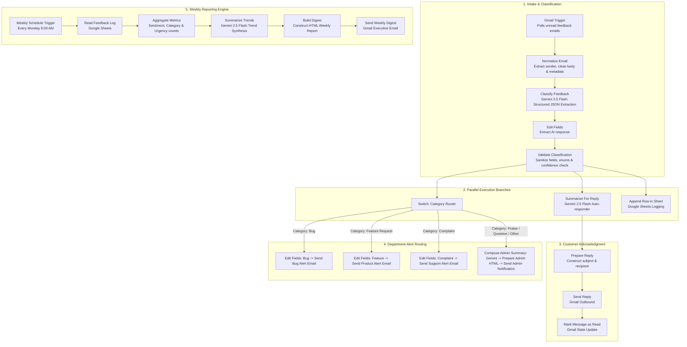

# Customer Feedback Intelligence (n8n Workflow)

An automated, AI-powered customer feedback classification, triage, and reporting engine built with **n8n**, **Google Gemini 2.5 Flash**, **Gmail**, and **Google Sheets**.

---

## 📖 Overview & What It Does

The **Customer Feedback Intelligence** workflow continuously monitors incoming customer support and feedback emails, uses Google Gemini AI to analyze and categorize each message, automatically responds to the customer, routes alerts to designated teams based on severity and category, logs all structured data to Google Sheets, and sends a scheduled weekly analytics digest to administrators.

### Key Capabilities
- **Automated Email Ingestion**: Listens for incoming feedback, bugs, complaints, and product mentions via Gmail triggers.
- **AI-Powered Multi-Attribute Classification**: Extracts structured information including product, feature, issue, sentiment, category, severity, summary, suggested actions, and confidence score.
- **Smart Validation & Quality Guardrails**: Cleanses, standardizes, and validates AI outputs with fallback thresholds for manual human review flags.
- **Instant Customer Acknowledgment**: Generates a professional, AI-crafted 1–2 sentence email response acknowledging the customer's input and marks original threads as read.
- **Role-Based Alert Routing**: Intelligently routes categorized feedback (Bugs, Feature Requests, Complaints, and General Admin inquiries) directly to the relevant internal department.
- **Centralized Data Logging**: Stores every classified feedback entry into Google Sheets for historical records and business intelligence.
- **Weekly Executive Digest**: Aggregates all feedback weekly, generates trend analysis with Gemini AI, and delivers an executive performance report.

---

## 🏗️ Architecture & System Design

The system is designed around two major workflows in a single n8n canvas:

1. **Real-Time Feedback Ingestion & Processing Pipeline** (Triggered on new unread emails)
2. **Weekly Analytics & Digest Pipeline** (Triggered via cron schedule every Monday at 9:00 AM)

### Architecture Diagram

---

## 🔄 Detailed Process Flow

### 1. Ingestion & AI Classification
1. **Gmail Trigger**: Polls Gmail every minute for unread emails matching keywords:
   `"E-commerce"`, `"Chat Interface"`, `"Dashboard"`, `feedback`, `complaint`, `issue`, `bug`, `error`, `broken`, `feature`, `help`, `failed`.
2. **Normalize Email**: Extracts clean email addresses, trims subjects and bodies (up to 4,000 characters), and tracks message IDs.
3. **Classify Feedback (Gemini 2.5 Flash)**: Evaluates the email and produces structured JSON against the defined taxonomy.
4. **Validation & Normalization**:
   - Ensures sentiment is one of `positive`, `neutral`, `negative`.
   - Ensures category is one of `bug`, `feature_request`, `complaint`, `praise`, `question`, `other`.
   - Sets severity (`low`, `medium`, `high`, `critical`).
   - Automatically marks `reviewRequired = true` if `confidence < 0.80` or classification is ambiguous.

### 2. Multi-Branch Real-Time Actions
Once validated, three parallel actions execute:
- **Auto-Reply**: Gemini drafts a personalized 1–2 sentence acknowledgment $\rightarrow$ Sent to the customer via Gmail $\rightarrow$ Original message marked as read.
- **Database Logging**: Appends a new row with all metadata and AI parameters into the designated Google Sheet.
- **Triage Dispatch**: The `Switch` node routes by category:
  - **`bug`**: Dispatched to the engineering bug triage inbox.
  - **`feature_request`**: Dispatched to the product management inbox.
  - **`complaint`**: Dispatched to customer relations/support.
  - **`praise` / `question` / `other`**: Gemini creates a short executive summary, formatted into an HTML card, and sent to general admin.

### 3. Weekly Digest Pipeline
1. **Schedule**: Runs automatically every Monday at 9:00 AM.
2. **Data Pull**: Fetches all logged feedback entries from Google Sheets.
3. **Aggregation Engine**: Computes total counts, distribution breakdown by sentiment, category, priority, and filters urgent items (high/critical severity).
4. **AI Trend Analysis**: Gemini synthesizes the quantitative statistics into a 3–5 sentence executive narrative.
5. **Digest Delivery**: Builds an HTML report containing key stats, trend narrative, and urgent items, then sends it via Gmail.

---

## 📊 Data Schema

### 1. AI Classification Output Schema
| Field | Type | Description / Allowed Values |
| :--- | :--- | :--- |
| `product` | string \| null | `Chat Interface`, `Dashboard`, `E-commerce`, or `null` |
| `feature` | string \| null | Extracted component (e.g. `Checkout`, `Payment`, `Search`, `Login`) |
| `issue` | string \| null | Concise statement of the primary subject or issue |
| `sentiment` | string | `positive`, `neutral`, `negative` |
| `category` | string | `bug`, `feature_request`, `complaint`, `praise`, `question`, `other` |
| `severity` | string | `low`, `medium`, `high`, `critical` |
| `summary` | string | 1 concise sentence summarizing the feedback |
| `suggestedAction` | string | 1 concise sentence recommending immediate next steps |
| `confidence` | number | Confidence score from `0.0` to `1.0` |
| `reviewRequired` | boolean | `true` if `confidence < 0.80` or ambiguous |

### 2. Google Sheets Logging Schema
The `Append row in sheet` node writes the following columns:
`receivedAt`, `from`, `subject`, `body`, `product`, `feature`, `issue`, `sentiment`, `category`, `severity`, `summary`, `suggestedAction`, `confidence`, `reviewrequest`.

---

## ⚙️ Prerequisites & Credentials

To import and run this workflow, ensure you have:

1. **n8n Instance**: n8n version `1.x` or higher (Self-Hosted via Docker / npm or n8n Cloud).
2. **Google Gemini API Account**: API Key with access to `gemini-2.5-flash` or n8n AI Gateway integration.
3. **Gmail OAuth2 Credentials**: Configured in n8n with permissions to read, send, and modify email labels/read status.
4. **Google Sheets OAuth2 Credentials**: Configured in n8n with read and write access to your target spreadsheet.

---

## 🚀 How to Setup and Run

### Step 1: Import Workflow into n8n
1. Open your n8n workspace.
2. In the left navigation, click **Workflows** $\rightarrow$ **Add Workflow**.
3. Click the **`...`** (three dots menu in top-right) and select **Import from File**.
4. Select `workflow.json` from this repository (or copy & paste its raw JSON content).

### Step 2: Configure Credentials
1. **Gmail OAuth2**:
   - Double-click any Gmail node (e.g., `Gmail Trigger` or `Send Reply`).
   - Select your configured Gmail OAuth2 credential.
2. **Google Sheets OAuth2**:
   - Double-click the `Append row in sheet` and `Read Feedback Log` nodes.
   - Select your Google Sheets OAuth2 credential.
3. **Google Gemini API**:
   - Double-click the Gemini nodes (`Classify Feedback`, `Summarize For Reply`, `Compose Admin Summary`, `Summarize Trends`).
   - Ensure the Gemini API credential is selected and model is set to `models/gemini-2.5-flash`.

### Step 3: Customize Google Sheets & Notification Destinations
1. **Google Sheets**:
   - In `Append row in sheet`, select your target Google Spreadsheet and worksheet tab name.
   - In `Read Feedback Log`, select the same spreadsheet for weekly reading.
2. **Email Alert Destinations**:
   - Update the `sendTo` email addresses in:
     - `Send a message` (Bug routing)
     - `Send a message1` (Feature requests)
     - `Send a message2` (Complaints)
     - `Send Admin Notification` (General inquiries / praise)
     - `Send Weekly Digest` (Weekly executive report)

### Step 4: Test & Activate
1. Click **Test Step** or **Test Workflow** in n8n with sample data.
2. Verify that:
   - A mock feedback email is classified accurately.
   - Google Sheet receives the new record.
   - Appropriate routing emails and customer reply emails are generated.
3. Toggle the workflow status switch in n8n from **Inactive** to **Active** to start automatic monitoring.

---

## 🛡️ Reliability & Design Highlights

- **Anti-Hallucination Constraints**: Gemini system prompts strictly mandate returning only verified product/feature entities and valid JSON output.
- **Fail-Safe Sanitization**: Code nodes normalize case sensitivities, trim whitespace, and enforce fallback values for invalid payloads.
- **Review Thresholding**: Automatically flags low-confidence or ambiguous items for manual human triage.
- **Idempotent Mark-as-Read**: Ensures each customer feedback email is only processed once.
